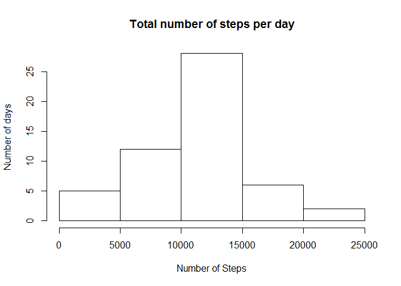
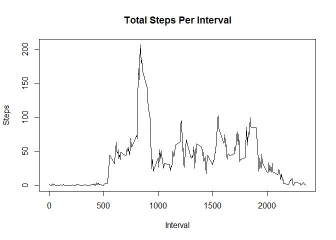
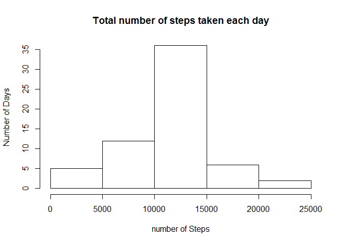

# Reproducible Research: Peer Assessment 1


## Loading and preprocessing the data

Data file contains comma separated values then I use read.csv method to read it.  
The file constains headers and some NA values.


```r
originalData <- read.csv("activity.csv",header=TRUE,stringsAsFactors=FALSE)
```

To preprocess the data I convert string dates to Date.


```r
originalData$date <- as.Date(originalData$date,"%Y-%m-%d")
```

## What is mean total number of steps taken per day?

Eliminate NA values in steps and calculate the total number of steps taken per day


```r
noNAData <- originalData[!is.na(originalData$steps),]
numberOfStepsPerDay <- aggregate(noNAData$steps, by=list(Date=noNAData$date), FUN=sum)
```

#### The histogram of the total number of steps taken each day is:


```r
hist(numberOfStepsPerDay$x, xlab = "Number of Steps", ylab = "Number of days", main = "Total number of steps per day")
```

 

#### The mean and median of the total number of steps taken per day are:

#### Mean: 

```r
meanPart1 <- mean(numberOfStepsPerDay$x)
meanPart1
```

```
## [1] 10766.19
```

#### Median:

```r
medianPart1 <- median(numberOfStepsPerDay$x)
medianPart1
```

```
## [1] 10765
```

## What is the average daily activity pattern?

Calculating the average number of steps taken, averaged across all days (y-axis)


```r
averageNumberOfStepsPerInterval <- aggregate(noNAData$steps, by=list(Interval=noNAData$interval), FUN=mean)
```

#### The time series plot (i.e. type = "l") of the 5-minute interval (x-axis) and the days (y-axis) is:


```r
plot(averageNumberOfStepsPerInterval, type = "l", xlab = "Interval", ylab = "Steps", main = "Total Steps Per Interval")
```

 

#### The 5-minute interval that contains the maximum number of steps, on average across all the days in the dataset is:


```r
averageNumberOfStepsPerInterval$Interval[which.max(averageNumberOfStepsPerInterval$x)]
```

```
## [1] 835
```

## Imputing missing values

#### The total number of missing values in the original dataset (i.e. the total number of rows with NAs) is:


```r
length(originalData[is.na(originalData$steps),1])
```

```
## [1] 2304
```

My strategy for filling in all of the missing values in the dataset is to use the mean for that 5-minute interval.  
Creating a new dataset that is equal to the original dataset but with the missing data filled in.


```r
fillingData <- originalData # make a copy of the original
cont = 0
for (i in fillingData$steps){ # looking for NA values
  cont = cont + 1
	if (is.na(i)){
		fillingData$steps[cont] = averageNumberOfStepsPerInterval[averageNumberOfStepsPerInterval$Interval == fillingData$interval[cont],2]
	}
}
```

#### The histogram of the total number of steps taken each day is:


```r
numberOfStepsPerDayNew <- aggregate(fillingData$steps, by=list(Date=fillingData$date), FUN=sum)
hist(numberOfStepsPerDayNew$x, xlab = "number of Steps", ylab = "Number of Days", main = "Total number of steps taken each day")
```

 

#### The mean and median of total number of steps taken per day are:

#### Mean:

```r
meanPart2 <- mean(numberOfStepsPerDayNew$x)
meanPart2
```

```
## [1] 10766.19
```

#### Median:

```r
medianPart2 <- median(numberOfStepsPerDayNew$x)
medianPart2
```

```
## [1] 10766.19
```

#### QUESTION: Do these values differ from the estimates from the first part of the assignment?

#### ANSWER: In this case, for this data, the defference is not very big:

#### Difference between Means:


```r
abs(meanPart1 - meanPart2)
```

```
## [1] 0
```

#### Difference between Medians:


```r
abs(medianPart1 - medianPart2)
```

```
## [1] 1.188679
```

#### QUESTION: What is the impact of imputing missing data on the estimates of the total daily number of steps?

#### ANSWER: In this case the impact is practically null but in other data file is possible to obtain a very big deviation (bias)

## Are there differences in activity patterns between weekdays and weekends?

CreatING a new factor variable in the dataset with two levels - "weekday" and "weekend" indicating whether a given date is a weekday or weekend day.


```r
weekendDays <- c("sábado","domingo") # create a set with weekend days
day <- gl(2,1, length = length(fillingData$steps),labels = c("weekday","weekend"))
cont = 0
for (i in 1:length(fillingData$date)){
  cont = cont + 1
	if (weekdays(fillingData$date[cont]) %in% weekendDays)
		day[cont] =  as.factor("weekend")
	else
		day[cont] = as.factor("weekday")
}
fillingData["dayType"] <- day
```

Preparing data and loading lattice library for plotting 


```r
averageNumberOfStepsPerIntervalPerDayType <- aggregate(fillingData$steps, by=list(Interval=fillingData$interval, DayType=fillingData$dayType), FUN=mean)
library(lattice)
```

#### The panel plot containing a time series plot (i.e. type = "l") of the 5-minute interval (x-axis) and the average number of steps taken, averaged across all weekday days or weekend days (y-axis) is:


```r
xyplot(x ~ Interval | DayType, data = averageNumberOfStepsPerIntervalPerDayType, layout = c(1, 2), type = "l", ylab = "Number of Steps")
```

 

#### It is possible to see that there is a significant difference in activity patterns between weekdays and weekends. The activity in weekends is bigger.
